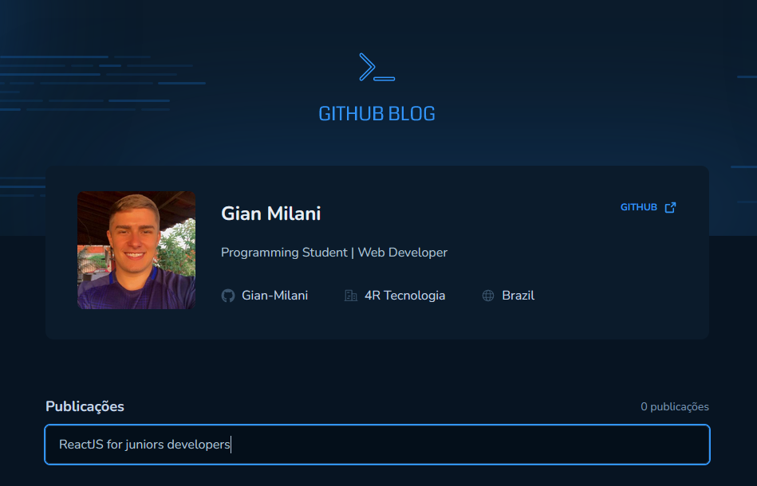
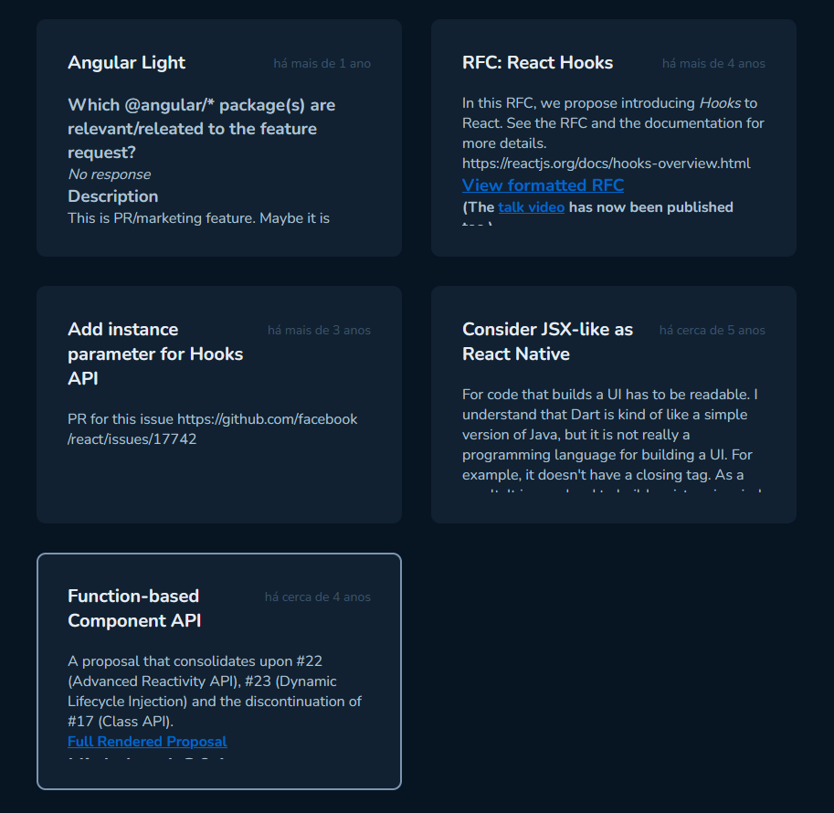
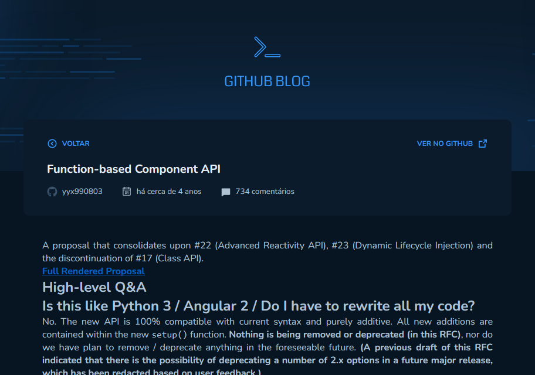

# GitHub Blog

## Origin

- Project created together with @Rocketseat 🚀

- Ignite trail | ReactJS ⚛️

## Features
- 🔍 Search for an issue by its keywords.


- 🖱️ Click on post you want to view.


- 👀 View your selected post. You can view the post in GitHub.


## Technologies used
 - HTML
 - CSS
 - Typescript
 - React JS

## Libraries used
 - axios
 - date-fns
 - eslint
 - phosphor-react
 - react-dom
 - react-markdown
 - react-router-dom
 - styled-components
 - vite

## How to run this project
```bash
# Clone this repository
$ git clone https://github.com/Gian-Milani/Github-blog.git

# Access the folder
$ cd Github-Blog

# Install dependencies
$ npm install 

# Run the aplication
$ npm run dev
```

## Resume
This project was based on a challenge from @Rocketseat's Ignite Journey, ReactJS trail. Practicing using HTTP clients, consuming the Github API to create a personal blog.

#

